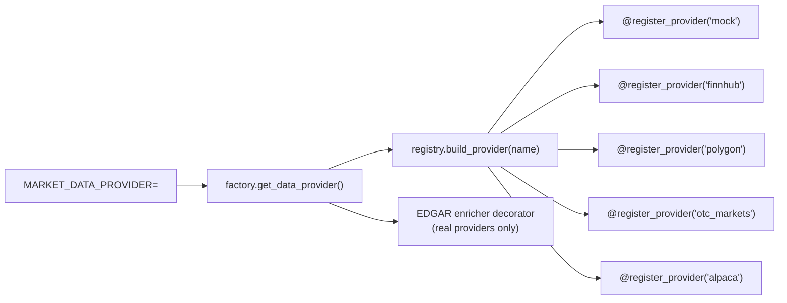
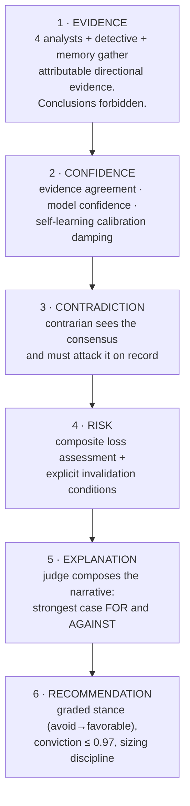

# AI Architecture — Agents, Reasoning Engine, and Provider Abstraction

| Field | Value |
|---|---|
| Version | 1.0 |
| Status | Implemented (`backend/app/services/agents/`, `backend/app/services/data_providers/`) |
| Companion docs | `SYSTEM-ARCHITECTURE.md` (system blueprint) · `PRD.md` (requirements) |

---

## 1. Provider Abstraction

### 1.1 The port

All market data flows through one interface — `MarketDataProvider`
(`data_providers/base.py`): `get_universe · get_ticker_meta · get_ohlcv ·
get_quote · get_fundamentals · get_news · get_corporate_actions`. No service
above the port knows which vendor is behind it.

### 1.2 The registry — providers are registered, never hardcoded

- Each adapter module self-registers a builder via `@register_provider(name)`
  at import time (`registry.py`). The factory contains **zero** provider
  names — adding a vendor touches only its own module plus one line in the
  adapter-module list.
- An unknown configured name fails at startup with the full list of what IS
  registered — misconfiguration is loud and self-documenting.
- **Registered ≠ implemented, honestly separated:** Polygon, OTC Markets and
  Alpaca are registered adapters that raise a message-rich
  `ProviderDataUnavailable` naming the vendor, the missing key, and the doc
  URL until their field mapping is written. Config never lies about
  capability.
- **Zero duplicated infrastructure:** rate limiting (token bucket), TTL
  caching, and typed HTTP failure handling live once in
  `http_base.RateLimitedHttpClient`. A new adapter is *only* field mapping —
  the Finnhub adapter is the reference implementation.
- **SEC EDGAR is deliberately not behind this port.** It supplies *filed
  facts* (dilution, filing status), not quotes — it runs as a scheduled
  ingester writing to Postgres, overlaid onto any real provider by the
  `EdgarEnrichedProvider` decorator (architecture D7). Decorators compose:
  future cross-cutting layers (failover, staleness banners) stack the same way.

### 1.3 Adding a provider (the whole procedure)

1. Create `data_providers/<vendor>_provider.py`; implement the port using
   `RateLimitedHttpClient` for all I/O.
2. Decorate a builder with `@register_provider("<vendor>")`; read keys from
   settings.
3. Add the module path to `registry._ADAPTER_MODULES`.
4. Write field-mapping tests over `httpx.MockTransport` fixtures.

Nothing else changes — not the factory, not the scorer, not the API.

---

## 2. The Agent Panel

The analytical engines (features/, ml/) compute numbers. The **agents**
(`services/agents/`) are the deliberative layer above them: each agent has
one clearly bounded responsibility and emits **Evidence** — an attributable,
directional (bullish/bearish/neutral), strength-weighted claim tied to a
machine-locatable source (`"technical.rsi_14"`, `"manipulation.toxic_dilution"`).
Agents never conclude; concluding is the Judge's monopoly.

| Agent | Responsibility (and its boundary) |
|---|---|
| **Technical Analyst** | Price/volume structure only: momentum (RSI, MACD), trend force (ADX), extension vs. moving averages, participation (RVOL). May not speak about fundamentals or news. |
| **Fundamental Analyst** | Solvency runway, dilution (EDGAR-fed), filing quality, going-concern, profitability. May not read charts. |
| **Sentiment Analyst** | Tone of coverage AND its trustworthiness — explicitly discounts positive tone when promotional ratio is high. |
| **News Analyst** | Catalysts: is anything actually happening? Flags structurally negative headlines (offerings, splits, delistings). Honest empty state: "no coverage" is evidence. |
| **Manipulation Detective** | Converts every active manipulation flag into adversarial evidence at severity-proportional strength; raises the statistical-anomaly case even when no named pattern fires. Holds a **stance veto** (see Judge). |
| **Memory Agent** | "Have we been here before?" — retrieves this ticker's logged predictions and graded outcomes (TP1/stop rates, realized returns). Empty history is reported as no experiential prior, never simulated. |
| **Contrarian Analyst** | Runs *after* consensus forms and is obligated to attack it: hunts the bear case against bullish consensus (overextension, promotion, drawdown-first odds, illiquidity) and the bull case against bearish consensus (capitulation, catalysts, insider alignment). A strong consensus is guaranteed at least one opposing argument — if no feature-specific one exists, the probability distribution itself supplies an honest one. |
| **Risk Manager** | Translates everything into loss terms: composite risk level (manipulation ⊕ illiquidity ⊕ drawdown-first ⊕ volatility), position-swing warnings, and the explicit **invalidation conditions** every verdict must carry. |
| **Portfolio Manager** | Position discipline: conviction-scaled allocation that can only shrink the risk-derived ceiling (never exceed it), horizon, and the tiered exit structure. |
| **Judge Agent** | The only concluder. Weighs the full evidence record, applies the manipulation veto (risk ≥70 caps stance at *cautious* regardless of bullish evidence), computes conviction multiplicatively (agreement × model confidence × learning damping, hard-capped 0.97), and must cite the strongest case against its own verdict. |
| **Self-Learning Agent** | Reads the calibration report (predicted vs. realized over graded outcomes) and produces the **conviction damping factor**: sparse history → precautionary damping (×0.85); measured miscalibration → proportional discount (down to ×0.5). Conviction is earned by track record, never asserted. |

---

## 3. The Reasoning Engine — deliberation as control flow

**The AI never answers immediately.** The staged pipeline is enforced as
control flow, not convention: the `Verdict` object cannot be constructed
until every prior stage has executed in order
(`agents/reasoning_engine.py`).

Structural guarantees (each is a tested invariant, `test_reasoning_engine.py`):

1. Stages always run in the mandated order; the full trace is returned —
   the deliberation is the product, the verdict is its last line.
2. Conviction ≤ 0.97 and only multiplies *down* (agreement, confidence,
   damping) — the system cannot talk itself up.
3. Stances are graded research positions (`avoid / cautious / neutral /
   constructive / favorable`), never buy/sell commands.
4. The contrarian always files findings; strong consensus always faces at
   least one opposing argument.
5. Every verdict carries ≥3 invalidation conditions including the concrete
   stop level.
6. The manipulation veto: no bullish evidence can lift a heavily-flagged
   ticker past *cautious*.
7. Without graded outcome history, conviction is automatically damped — the
   platform is structurally humble until its track record earns otherwise.

### 3.1 Surface

`GET /api/v1/stocks/{symbol}/deliberation` returns the complete trace:
per-stage summaries, every evidence item (agent, claim, direction, strength,
source, value), stage metrics, and the final verdict with reasons for,
reasons against, invalidations, and sizing.

### 3.2 Relationship to the scoring pipeline

`scoring/scorer.py` remains the numeric contract (scores, probabilities,
trade plan) — fast, cacheable, consumed by dashboards. The reasoning engine
consumes that same analysis plus raw features and produces the *argued*
version. They can never disagree on numbers because the deliberation's
quantities are read from the same `StockAnalysis` object.

### 3.3 Planned evolution

- **LLM-argued stages (Phase 4+):** each agent's evidence list becomes
  grounding for an LLM-written argument; the Evidence schema, stage order
  and honesty caps are unchanged — language gets richer, structure stays
  enforced.
- **Memory Agent nearest-neighbor retrieval (FR-807):** similarity over
  stored feature snapshots once graded history accumulates, replacing
  same-ticker-only lookback.
- **Chat integration:** the assistant answers "why?" by quoting deliberation
  evidence verbatim instead of re-deriving.
