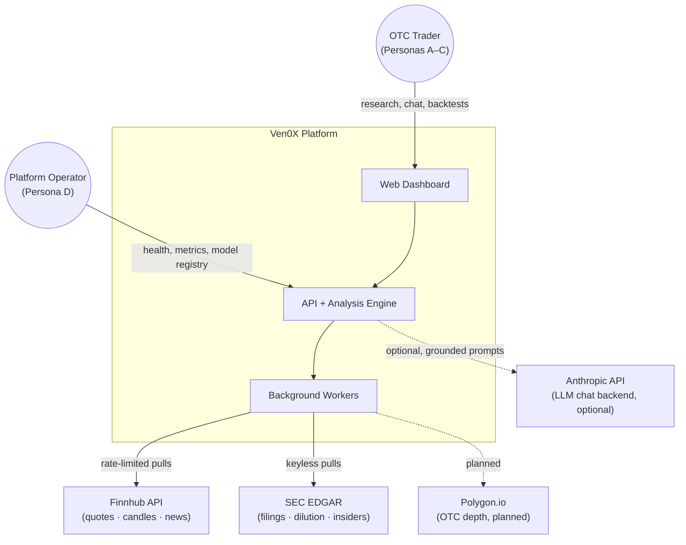
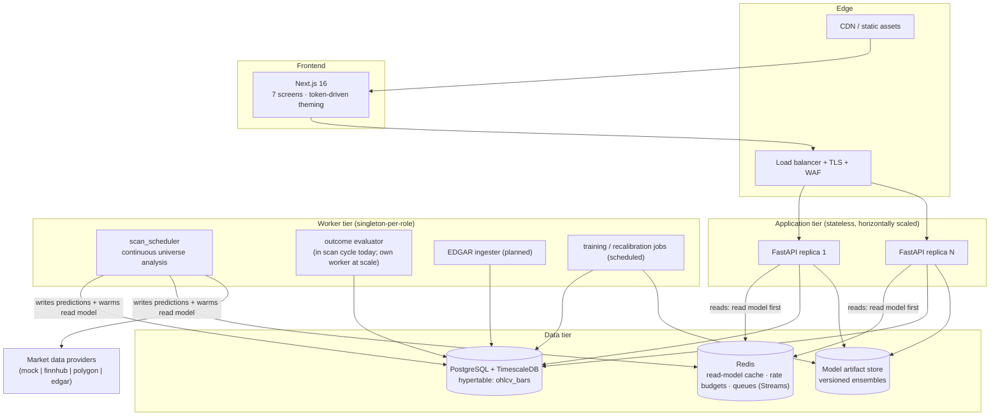
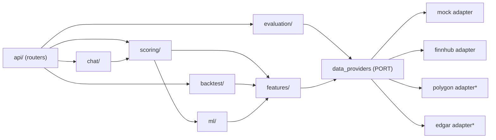
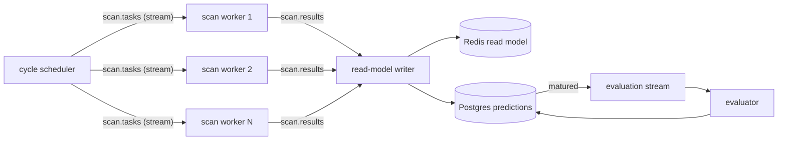
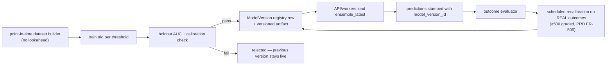
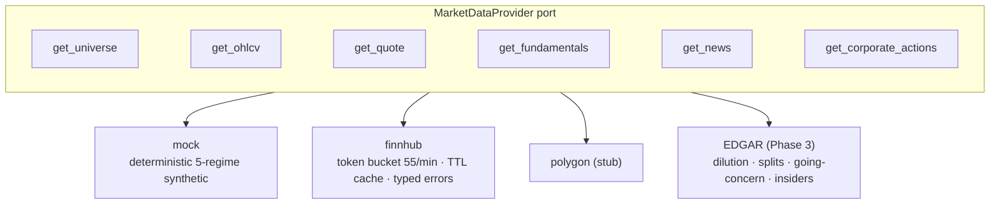
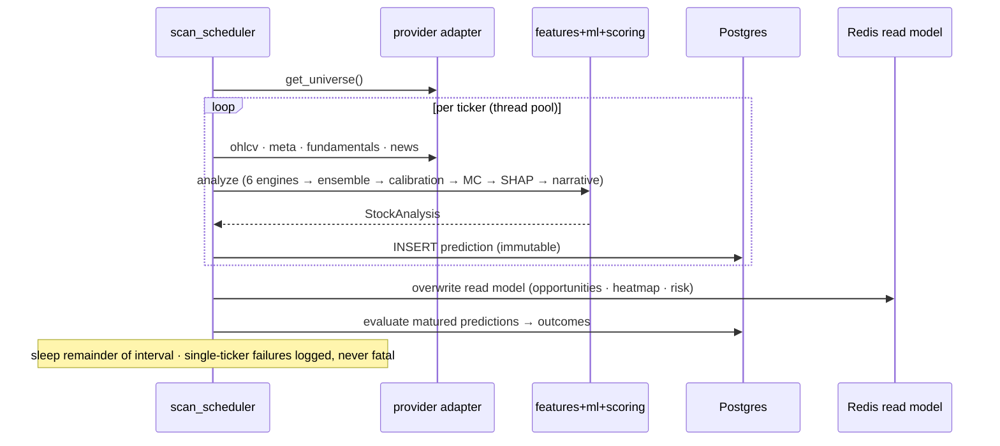
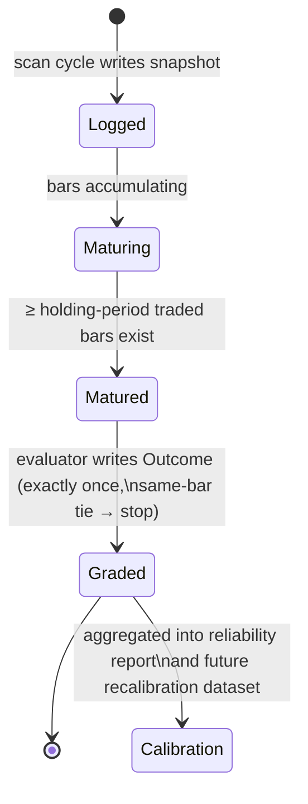
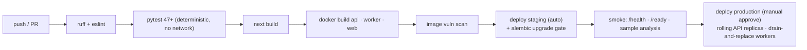

# System Architecture — Ven0X OTC Intelligence Platform

| Field | Value |
|---|---|
| Version | 1.0 |
| Status | Approved blueprint — governs all implementation |
| Companion docs | `PRD.md` (what we build) · `ARCHITECTURE.md` (as-built decision log) |
| Scale targets | 2,000-ticker universe · thousands of concurrent users · 24/7 scanning |

---

## 1. Architectural Style — Alternatives Considered

The foundational decision everything else hangs off. Four candidates were evaluated against this product's actual constraints: a small team, a compute-heavy analytical core, bursty read traffic, one write-heavy background pipeline, and a hard honesty requirement (every number traceable to its inputs).

| Criterion | A. Classic monolith | B. **Modular monolith → selective extraction** | C. Microservices-first | D. Serverless/FaaS |
|---|---|---|---|---|
| Time-to-correctness (small team) | Good | **Best** — one deploy, one debugger, full-stack tests | Poor — distributed debugging tax from day one | Fair |
| Long-term scalability | Poor — no seams to split on | **Good** — seams pre-cut at module boundaries | Best in theory, if boundaries guessed right | Poor fit — scan cycles exceed FaaS runtime/memory envelopes; GBM/SHAP cold starts are brutal |
| Operational cost now | Lowest | **Lowest** | High (service mesh, N pipelines, distributed tracing mandatory) | Deceptively high (per-invocation ML compute) |
| Risk of wrong service boundaries | n/a | **Low** — boundaries validated in-process before extraction | High — wrong cuts are the classic microservices failure mode | High |
| Data consistency (prediction ↔ outcome ↔ calibration) | Easy | **Easy** — one transactional store | Hard — sagas/outbox for our core truth loop | Hard |
| Team scaling later | Poor | **Good** — modules map to future team ownership | Good | Fair |

**Decision: B — modular monolith with pre-cut seams, extracting services only when a trigger fires.**

Rationale: microservices solve an *organizational* scaling problem we do not have, at the price of a *distributed-systems* tax we would pay immediately. The failure mode to avoid is not "monolith too big" — it is "wrong service boundaries chosen before the domain was understood." Our module boundaries (`data_providers`, `features`, `ml`, `scoring`, `backtest`, `evaluation`, `chat`) are already interface-fronted; each is an extraction candidate whose seam has been validated in production *before* paying the network hop. Extraction triggers are defined in §10.

---

## 2. System Context (C4 Level 1)

The platform is strictly a **pull** system with respect to money: no broker connections, no order flow, no custody (PRD NG1). External surface area is read-only market data plus one optional LLM call path.

---

## 3. Container Architecture (C4 Level 2) — Target State

**Key structural rule:** the API tier *reads*, the worker tier *writes*. Today the API can still compute on-demand (acceptable at 30 tickers); at scale the workers become the only path that touches providers and the only writer of analysis state (PRD FR-205). This is CQRS-lite without the ceremony: one database, two access patterns.

---

## 4. Backend — Hexagonal Modular Monolith

### 4.1 Decision

FastAPI application organized as **ports and adapters**: domain services (`features`, `ml`, `scoring`, `backtest`, `evaluation`) depend only on the `MarketDataProvider` port and the SQLAlchemy repository layer; vendors and frameworks live at the edges. Already implemented; this document makes it binding.

**Alternatives rejected:**
- *Django* — batteries we don't need (admin, templates), weaker async story, heavier coupling temptation.
- *Node/NestJS backend* — would split the codebase from the ML stack (Python-native LightGBM/XGBoost/CatBoost/SHAP); two runtimes for one domain is an unforced error.
- *Layered-by-technical-role only* (controllers/services/repos with no domain modules) — produces a big ball of mud with clean-looking folders; our modules are *domain* seams, which is what makes later extraction possible.

### 4.2 Module dependency law

Enforced conventions: routers contain zero business logic (DI + serialization only); no module imports a sibling's internals — only its public functions; **no module except adapters may perform network I/O**. A grep for `httpx|requests` outside `data_providers/` and `chat/` failing CI is the cheap enforcement (planned lint rule).

---

## 5. Data Architecture

### 5.1 Primary store — alternatives

| Criterion | **PostgreSQL + TimescaleDB** | ClickHouse | InfluxDB | MongoDB |
|---|---|---|---|---|
| OHLCV time-series at scale | Good (hypertables, compression, continuous aggregates) | Best raw analytics | Good | Poor |
| Relational integrity for the truth loop (prediction→outcome, FK-linked, transactional) | **Best** | Weak (not its job) | Weak | Weak |
| One store for both workloads | **Yes** | No — would still need Postgres | No | No |
| Operational surface for a small team | **One database** | Two | Two | Two |

**Decision: PostgreSQL + TimescaleDB.** The deciding argument is the truth loop: predictions, outcomes, model versions, and calibration are *relational, transactional* data whose integrity is the product's credibility. Timescale gives the OHLCV workload hypertable partitioning, native compression, and continuous aggregates *inside the same database*, so a small team operates one system. ClickHouse becomes worth revisiting only if ad-hoc analytical scans over billions of bars become a product feature (not on the roadmap).

### 5.2 Schema disciplines (binding)

- Hypertables **only** for genuinely high-volume series (`ohlcv_bars`, natural key `ticker_id, ts, timeframe`). Business tables keep single-column autoincrement PKs + time indexes — the composite-PK/autoincrement conflict already bit us once (see as-built log) and is now a review checklist item.
- Predictions and outcomes are **append-only**; corrections are new rows, never updates. Auditability is a feature.
- Retention (Phase 5): raw 1-day bars kept 3 years compressed; predictions/outcomes kept forever (they are the product's track record and are small); news pruned to 18 months.
- Migrations via Alembic from Phase 3 onward (`create_all` is acceptable only while pre-multi-user).

### 5.3 Caching — a three-layer contract

| Layer | Where | TTL | Invalidation | Serves |
|---|---|---|---|---|
| L1 in-process | API replica memory | 30s | TTL only | hot repeat reads within a replica |
| L2 shared read model | Redis | scan-cycle length | overwritten by each scan cycle | dashboard/opportunities/risk-monitor fan-out across replicas |
| L3 provider fact cache | in provider adapter (today) → Redis (multi-replica) | 5 min | TTL only | de-duplicating vendor calls; rate-budget protection |

Rules: caches are *optimizations, never sources of truth* — every cached object is reconstructible from Postgres + providers. Backtests and the outcome evaluator **always bypass** caches (point-in-time correctness). Staleness is surfaced, not hidden: when the read model is older than 2× scan interval, the API attaches a staleness banner field (PRD FR-107).

### 5.4 Message queue — deliberately deferred, with a chosen successor

**Current state: no broker — and that is a decision, not an omission.** The single scan worker is a sequential loop; adding Kafka now would be resume-driven engineering.

**Trigger to introduce queueing:** any of — universe >500 tickers (scan must parallelize across processes) · user-facing async jobs (on-demand backtests queued per user) · watchlist alerting (fan-out).

**Chosen technology when triggered: Redis Streams** (consumer groups, at-least-once, replay) — because Redis is already in the stack and our volumes (thousands of messages/cycle, not millions/sec) are far below Kafka's justification threshold. Kafka is reconsidered only with sustained >10k msg/s or multi-consumer event sourcing. All queued handlers must be **idempotent** (the outcome evaluator already models this discipline).

---

## 6. Authentication & Authorization (Phase 5 — design fixed now)

| Option | Verdict |
|---|---|
| Server sessions + cookies | Rejected: sticky state fights stateless horizontal scaling |
| **JWT access (15 min) + rotating refresh (httpOnly cookie)** | **Selected** — stateless verification at every replica; short access TTL bounds token theft; refresh rotation with reuse detection |
| Fully outsourced IdP (Auth0/Cognito) | Deferred: acceptable swap later behind the same middleware; avoided now for cost + data locality |

Model: `users` table (argon2id hashes), OAuth (Google/GitHub) as federated identities, roles `user`/`operator` (RBAC via FastAPI dependency), per-user ownership on watchlists/portfolios/chat sessions, per-user+IP token-bucket rate limits in Redis on expensive endpoints (`/backtest/run`, `/scan/*`), full audit log of auth and mutating events. API keys (hashed, scoped) for programmatic users in Phase 6. Secrets only via environment/secret manager; config scaffolding (`SECRET_KEY`, expiry, algorithm) already exists.

---

## 7. AI/ML Services Architecture

### 7.1 Inference — in-process now, extractable by design

The ensemble (3 GBM families × 3 thresholds), SHAP, and Monte-Carlo run **in-process** — model artifacts are ~MBs, CPU inference is milliseconds, and a network hop would add latency for nothing.

**Extraction trigger (fires in Phase 4):** the FinBERT-class text model (PRD FR-606). Transformer inference wants a GPU and different scaling economics → it becomes the first real microservice, `inference-svc`, behind the same interface the neutral-sentiment stub occupies today. This is the pre-cut-seam strategy working as intended.

### 7.2 Model lifecycle

Binding rules: every prediction records the model version that produced it (traceability); a new model version never silently replaces a live one without registry entry + metrics; recalibration on realized outcomes is a *scheduled job*, not a manual ritual. Artifact store is a volume today → object storage (S3-compatible) at deployment Phase B.

### 7.3 LLM chat backend

Template backend is the default and permanent fallback (deterministic, free, offline). LLM backend (Anthropic) is config-gated, receives **only** the computed `StockAnalysis` JSON as grounding, and its system prompt hard-codes the no-certainty/no-advice principles. LLM outages degrade to templates — the assistant never goes down with a vendor.

---

## 8. Market Data Services

Binding disciplines (all live in the adapter layer, invisible above the port):

1. **Honesty contract** — a vendor's missing field is `None`/explicit-neutral, never approximated (PRD P2). Downstream signals degrade visibly.
2. **Rate budgeting** — every adapter owns a token bucket under its vendor quota; the platform can point the full pipeline at any adapter without 429 storms.
3. **Typed failures** — `ProviderDataUnavailable` with the upstream cause; no silent empty frames.
4. **Failover chain (Phase 3)** — primary → secondary → *stale cache with visible staleness banner* → error. Never a fabricated fallback.
5. **EDGAR is an ingester, not a request-path adapter** — filings are pulled on schedule into Postgres (share-count history → real dilution %, split history, going-concern text hits, Forms 3/4/5), because EDGAR latency/fair-use rules don't fit interactive calls. The fundamentals port then reads locally.

---

## 9. Core Runtime Flows

### 9.1 Scan cycle (sequence)

### 9.2 Prediction lifecycle (state)

---

## 10. Microservice Extraction Roadmap

A module is extracted **only when a trigger fires**, never for architectural fashion:

| Candidate | Trigger | Transport |
|---|---|---|
| `inference-svc` (text models) | FinBERT integration (needs GPU) — Phase 4 | HTTP, same interface as today's stub |
| `scan-workers` (N parallel) | Universe >500 tickers | Redis Streams work queue |
| `edgar-ingester` | EDGAR integration lands (different cadence/failure domain) | Scheduled job → Postgres |
| `backtest-svc` | User-facing async backtests contend with API CPU | Queue + result store |
| `chat-svc` | LLM traffic cost/isolation warrants it | HTTP |

Everything else stays in the monolith indefinitely. Each extraction inherits: its module's existing interface (unchanged callers), idempotent handlers, and its own dashboard + alerts before cutover.

---

## 11. Monitoring & Observability (Phase 5, design fixed)

- **Structured JSON logs** with request IDs (API) and cycle IDs (workers); provider calls logged with vendor, endpoint, latency, outcome.
- **Prometheus metrics:** scan cycle duration & per-ticker analysis time; provider error/429 rates; cache hit ratios per layer; evaluation backlog (ungraded matured predictions — *this is the product-truth SLO*); calibration gap per bucket; API p50/p95/p99.
- **Alerts:** scan cycle failed twice consecutively · evaluation backlog >1 cycle · provider error rate >20% over 15 min · calibration gap drift beyond threshold (model honesty alarm — pages a human, PRD P4).
- **Error tracking:** Sentry (API + frontend). **Tracing:** OpenTelemetry deferred until first extraction (single process = a profiler suffices).
- `/health` (liveness, exists) + `/ready` (DB/Redis/artifact checks, planned).

---

## 12. CI/CD & Deployment

### 12.1 Pipeline

Non-negotiables already in force: no network in CI (stubbed transports); deterministic seeds; frontend must lint+build clean. Added at Phase 3: migration gate (pipeline fails if models drift from migrations); at Phase 5: image scanning + staged deploys.

### 12.2 Deployment — alternatives

| Option | Verdict |
|---|---|
| **A. docker-compose on one VM + managed Postgres** | **Now.** Matches actual load; one command; cheapest correct thing. Exists. |
| **B. Managed containers (Cloud Run / ECS Fargate / Fly.io) + managed Timescale + managed Redis** | **Phase 5 target.** API autoscales on requests; workers as always-on services; zero cluster ops. |
| C. Kubernetes | Deferred until ≥5 distinct services + custom scheduling needs (GPU inference pools). Adopting it earlier is pure overhead for a team this size. |
| D. Serverless | Rejected for core (long CPU-bound cycles, model cold starts); acceptable later for edge utilities only. |

Environment story: identical images promoted dev → staging → prod; configuration exclusively via environment; SQLite fallback remains a *development* convenience, never a deployment tier.

---

## 13. Cross-Cutting Decisions Log (summary)

| # | Decision | Why (one line) |
|---|---|---|
| D1 | Modular monolith, pre-cut seams | Validate boundaries in-process before paying the distributed tax |
| D2 | Postgres+Timescale single store | The truth loop is relational; one database for a small team |
| D3 | CQRS-lite: workers write, API reads | Interactive reads must never depend on vendor latency |
| D4 | Redis Streams over Kafka (when queueing triggers) | Volumes 3 orders of magnitude below Kafka's justification |
| D5 | JWT+refresh over sessions | Stateless replicas; bounded token-theft window |
| D6 | In-process ML inference; GPU text model = first extraction | Milliseconds CPU inference gains nothing from a network hop |
| D7 | EDGAR as scheduled ingester, not request-path adapter | Fair-use + latency; fundamentals read locally |
| D8 | Honesty contract in adapters (None over approximation) | P2 is architecture, not a comment |
| D9 | Append-only predictions/outcomes | The track record is the product; auditability is a feature |
| D10 | Calibration-drift alert pages a human | A miscalibrated model is a *product integrity* incident, not a metric |
